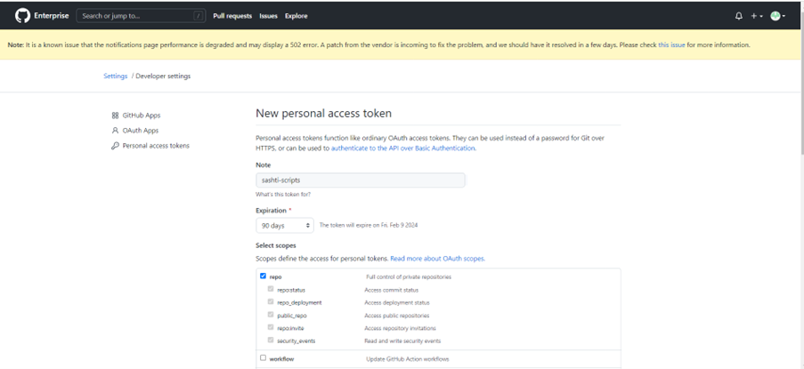

# How to connect AAP and GIT accounts

Please find below the reference screenshots and follow the said steps

**Step: 1**

**Step: 2**

**Step: 3**

**Step: 4**

**Step: 5**

**Step: 6**

**Step: 7**

**Step: 8**

**Step: 9**

**Step: 10**

**Step: 11**

