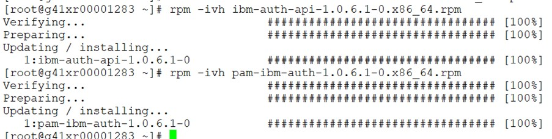
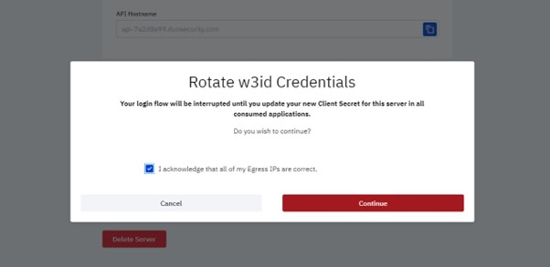

<h1 align="center">2FAaaS on w3id SSO</h1>

## Goal

This article helps you with the configuration steps for W3ID authentication in Linux servers.

## Procedure

Please follow the below mentioned steps and let us know if you need help on trobleshooting.

!!! warning "Note"
    Please keep your current session open and active to prevent a lockout from the server and use a separate window for testing!

***Step: 1***

Please download the ‘ISVGForLinuxPAM106’ file attached here.

============>>>
[ISVGForLinuxPAM106.zip](./pictures/ISVGForLinuxPAM106.zip){:download="ISVGForLinuxPAM106.zip"}
<<<============

Extract the compressed .zip file. Then, unzip the appropriate package for your version of Linux. You will need to transfer the 2 rpm files to the target host.

***Step: 2***

Install the 2 rpms in the server as shown below.



***Step: 3***

Backup the below 3 files before modifying it.

[root@g41xr00001283 ~]# cp /etc/pam.d/sshd /etc/pam.d/sshd_17MAY24
[root@g41xr00001283 ~]# cp /etc/pam_ibm_auth.json /etc/pam_ibm_auth.json_17MAY24
[root@g41xr00001283 ~]# cp /etc/ssh/sshd_config /etc/ssh/sshd_config_17MAY24

***Step: 4***

In /etc/pam.d/sshd file please do the modifications as shown below.

```bash

#%PAM-1.0
#auth       required pam_sepermit.so
auth        [success=1 default=ignore]   pam_exec.so quiet /usr/local/sbin/ssh-pubkey-check.prl
auth       substack password-auth
#auth       required pam_env.so
auth    sufficient pam_ibm_auth.so id=pam_ibm_auth
#auth       sufficient /lib64/security/pam_duo.so
#auth       requisite pam_succeed_if.so uid >= 1000 quiet_success
auth       required pam_deny.so

```

***Step: 5***

Please create a perl script file and update with the below script.

```bash

[root@g41xr00001283 ~]# cat /usr/local/sbin/ssh-pubkey-check.prl
#!/usr/bin/perl

if ($ENV{'SSH_AUTH_INFO_0'} =~ /^publickey /) {
  exit(0);
} else {
  exit(1);
}
[root@g41xr00001283 ~]# chmod 755 /usr/local/sbin/ssh-pubkey-check.prl

```

***Step: 6***

Login to the 2fa portal using below link, go to the "Manage Your Servers" option and search for the respective target server.

<https://ies-2faaas-alias-frontend.prod.identity-services.intranet.ibm.com/>


***Edit the =='Server Information'==, remove the ==‘Egress IP’== and save that session.***


***Copy the =='Client ID'== available under the w3id credentials and have it noted.***


***Use the =='Rotate w3id Creds'== option. Agree the acknowledment and click =="Continue"==***



***You will get a pop-up screen as shown below. This screen will last only for  60 seconds. Copy the =='Client secret'== code and have it noted.***


***Step: 7***

Replace the noted =='Client secret'== code in below command and execute the same. You will get a new =='obf-client-secret'== key and have this too noted.

```bash
[root@g41xr00001283 ~]# /opt/ibm/ibm_auth/ibm_authd_64 --obf "Client_Secret"
blHt************************************y+M=
[root@g41xr00001283 ~]#
```

***Step: 8***

Update the noted =='Client-id'== and =='obf-client-secret'== key in the below code ==< fill >== area in the json file.

```bash
[root@g41xr00001283 ~]# cat /etc/pam_ibm_auth.json
{
    "ibm-auth-api":{
        "client-id":"<fill>",
        "obf-client-secret":"<fill>", /* Use /opt/ibm/ibm_auth/ibm_authd[_64] --obf <secret>*/
        "protocol":"https",
        "host":"login.w3.ibm.com",
        "port":"443",
        "max-handles":"16"
    },
    "ibm-authd":{
        "trace-file":"/tmp/ibm_authd.log"
    },
    "pam":{
        "trace-file":"/tmp/pam_ibm_auth.log",
        "pam_ibm_auth":
        {
        "additional-args":
        [
                "auth_method=choice-then-otp",
                "add_devices_to_choice",
                "gecos_field=6",
                "gecos_separator=/",
                "exempt_group=example123",
                "user_name_attr=emails.type%20eq%20%22work%22%20and%20emails.value",
                "debug"
        ] }
    }

}

```

=== "JSON file Before updating"
    

=== "JSON file After updating"
    

***Step: 9***

Ensure that the GECOS fields are properly updated for all user IDs as stated below. Notify to application team to update the same with the appropriate mail-id to which the authentication will be prompted.


***Step: 10***

Then restart the sshd service.

```
    # systemctl restart sshd
```

***Step: 11***

Now, try to login to the same host in a duplicate session. Then you will receive the authentication screen as shown below.


Here I choosed "option: 1" so i received OTP to my mail-id and post entering the passcode I got my SSH session.

--------------------------------------------------------------------
