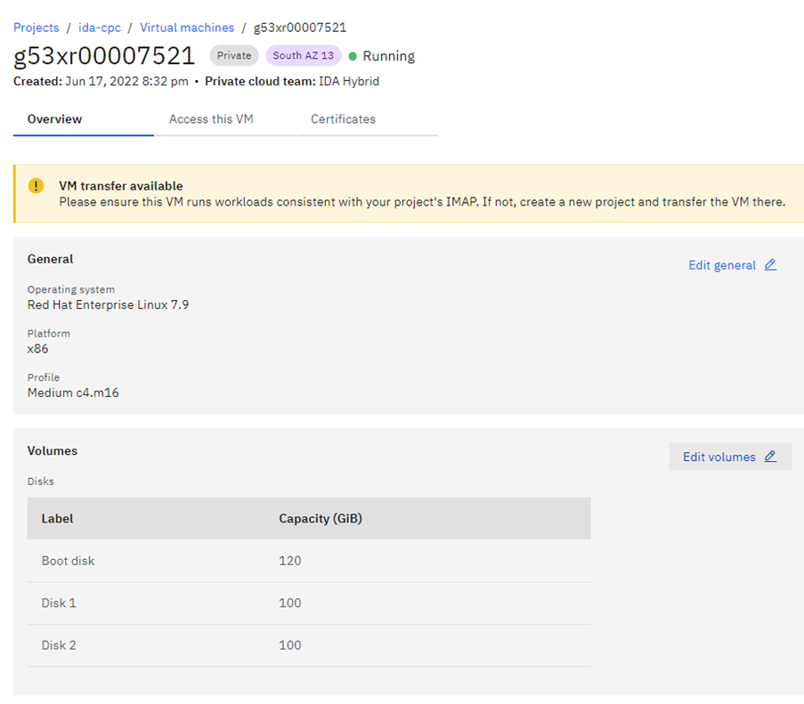
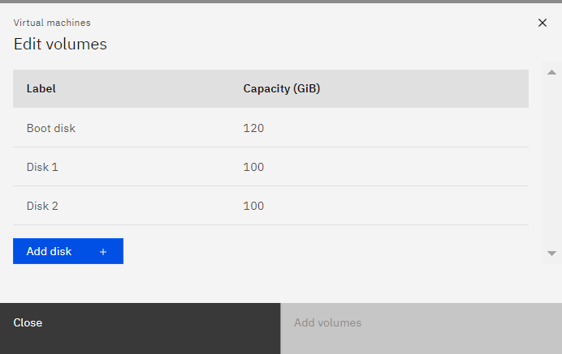
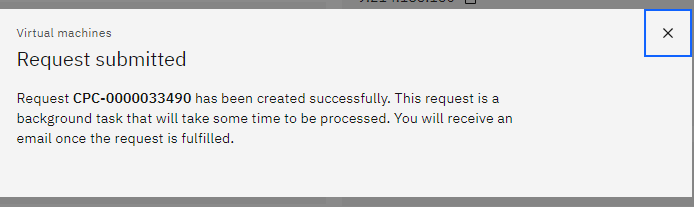
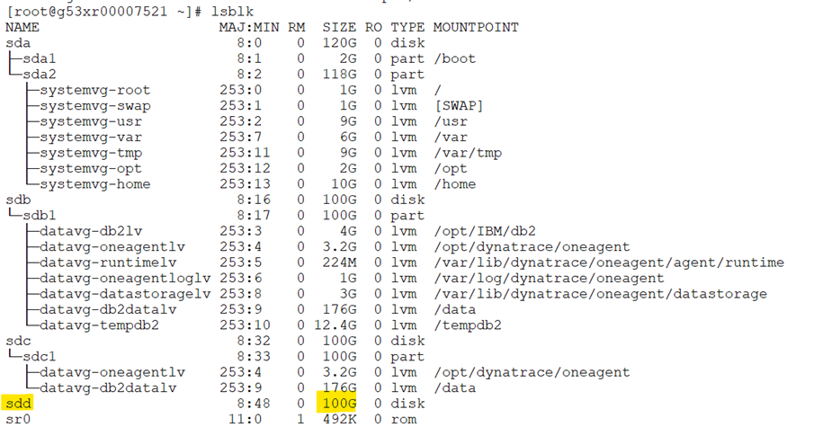
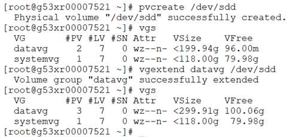

<h1 align="center">CPC Disk Addition</h1>  
## Goal

This article helps you to create and add a new virtual disk to an existing Linux virtual machine on CPC.

## Procedure

Here are the steps for adding a new virtual disk on a Linux virtual machine.  


📌  ***No downtime is required for this activity***


**Step: 1**

Search for the respective host in the CPC portal based on the IMAP or project ID and click it to open further. 


**Step: 2**

Once we got the host screen, check the list of existing disk volumes. Use the ***"Edit Volumes"*** option for adding new volume to the host.



**Step: 3**

The ***"Edit Volumes"*** screen will be like this. In that click the ***"Add Disk +"*** option.



**Step: 4**

Select the required disk space and use the ***"Add Volumes"*** option for volume addition.


**Step: 5**

Post that you will be prompted with the CPC request ID.



**Step: 6**

In sometime, you will be receiving a task successfull completion mail. Once you recieved such mail please proceed with the below steps.
  
  > If you didn't receive such mail then please reach to the #cirrus-platform-support slack channel further assistance.


**Step: 7**

Please execute the below command. If you are able to see the newly added disk then the CPC disk addition request is succeeded. 

 > If not able to see the disk then reach to the #cirrus-platform-support slack channel for support.

```bash
# lsblk
```


Use below commands for expanding the added disk space to the volume group and then the required size to the logical volume.
```bash
# pvcreate /dev/sdd
# vgextend datavg /dev/sdd
# lvextend -L +20G /dev/mapper/datavg-tempdb2 -r
```


**Before expansion:**
```bash
[root@g53xr00007521 ~]# df -hTP /tempdb2
Filesystem                Type  Size  Used Avail Use% Mounted on
/dev/mapper/datavg-tempdb2 xfs    30G   28G  1.6G  95% /tempdb2
[root@g53xr00007521 ~]# 
```
**After expansion:**
```bash
[root@g53xr00007521 ~]# df -hTP /tempdb2
Filesystem                Type  Size  Used Avail Use% Mounted on
/dev/mapper/datavg-tempdb2 xfs    50G   29G   22G  57% /tempdb2
[root@g53xr00007521 ~]#
```