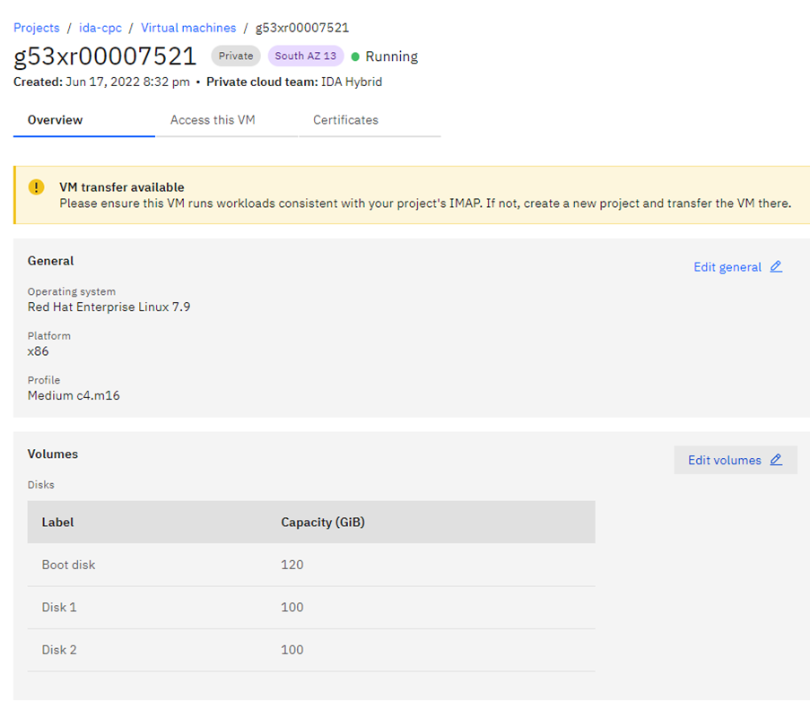
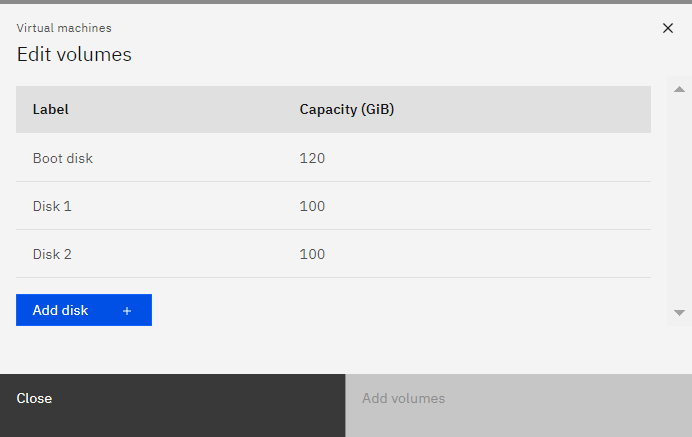
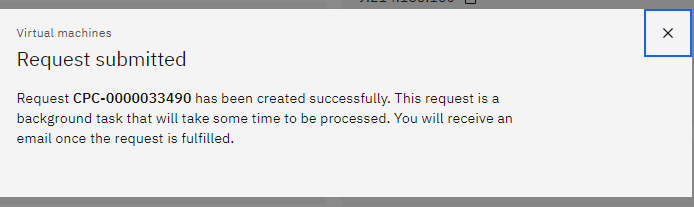

**Step: 1**


**Step: 2**



**Step: 3**



**Step: 4**


**Step: 5**



**Step: 6**


**Step: 7**


###Below commands can be used for multipath LV expansion

```bash

# pvcreate /dev/mapper/mpathb
# vgextend datavg /dev/mapper/mpathb
# vgs
# df -hTP /tempdb2
# lvextend -L +2G /dev/mapper/datavg-tempdb2lv -r
# df -hTP /tempdb2

```

---

###Below commands can be used for LV expansion

```bash
[root@g53xr00006301 ~]# vgs
VG       #PV #LV #SN Attr   VSize    VFree
  datavg     2   9   0 wz--n-  199.99g  90.84g
  systemvg   1   7   0 wz--n- <118.00g <78.73g
[root@g53xr00006301 ~]# lvextend -L +20G /dev/mapper/datavg-datalv -r
```
**Before expansion:**
```bash
[root@g53xr00006301 ~]# df -hTP /data/disk1
Filesystem                Type  Size  Used Avail Use% Mounted on
/dev/mapper/datavg-datalv xfs    30G   28G  1.6G  95% /data/disk1
[root@g53xr00006301 ~]# 
```
**After expansion:**
```bash
[root@g53xr00006301 ~]# df -hTP /data/disk1
Filesystem                Type  Size  Used Avail Use% Mounted on
/dev/mapper/datavg-datalv xfs    50G   29G   22G  57% /data/disk1
[root@g53xr00006301 ~]#
```