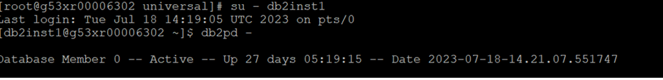
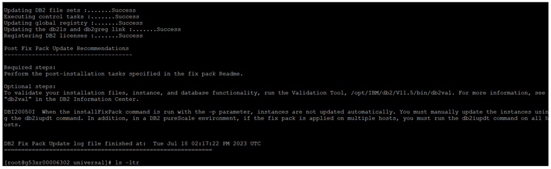
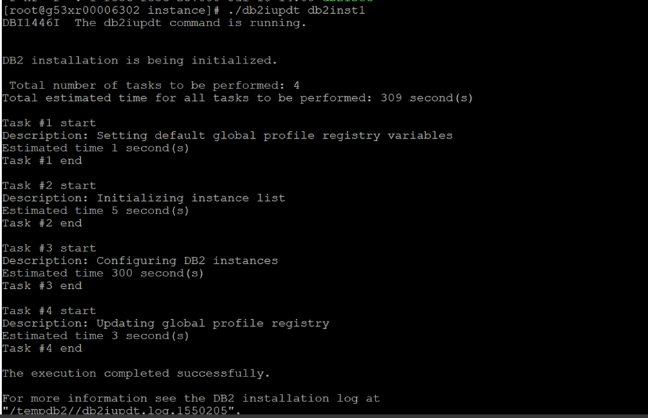
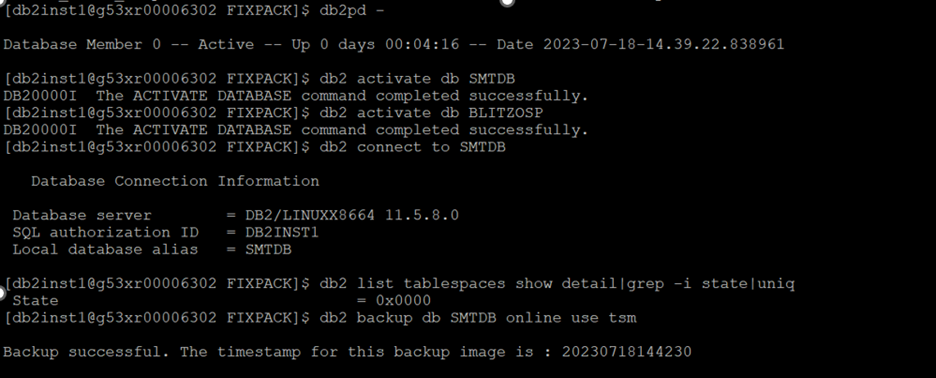

<h1 align="center">DB2 Fix pack Installation</h1>  

## Goal

This article helps you to pursue the DB2 fixpack installation in appropriate hosts.

## Procedure

      📌  Downtime is required for this activity

#### Pre-installation task

1. We should have the root access to start DB2 fix pack activity.

         sudo su -

2. Check the file system space available.

      a) The Installation Path - /opt/IBM/db2 (At least 2GB free space should be available)  
      b) /tmp FS try to keep 4GB free space to download the software.  
      c) Please check the other db2 Filesystems. Better to keep all the db2 Filesystems below 80% used.  

         df -h     ---> for Linux
         df -gt    ---> for AIX

#### Pre fixpack install steps

1. Manual backup of Database Configuration parameters. Create directory of DB2 fix pack.

         a) mkdir fixpack_V11.5.8
         b) cd fixpack_V11.5.8
         c) db2licm -l > db2licm_before.out
         d) db2level > db2level_before.out
         e) db2 get dbm cfg  > dbmcfg_before.out
         f) db2 list db directory > dbdir_before.out
         g) db2 list node directory > nodedir_before.out
         h) db2set -all > db2set_before.out
         i) db2 connect to <dbname>; db2 get db cfg for dbname > dbcfg_<dbname>_before.out
         j) db2 list tablespaces show detail > tablespaces_before.out
         k) db2look -d dbname -e -x -o db2look_before.out
         l) db2support  . -d <dbname> -c -s
         m) crontab -l > crontab_before.out

2. Perform database backup.

   a) Application team need to stop all the connected applications. Once they stopped, we will get the output like below.

         db2 list active databases (or) db2 list applications

   b) Deactivate the database

            db2 deactivate db <dbname>

   c) Take offline database backup to TSM

            db2 backup db <dbname> use TSM

#### Steps for Installation

:arrow_right: Stop db2 services. Switch to each instance and execute the following commands.

!!! warning
      Ensure application team brings down the application which are connected to the database.

   1)Make sure we don’t have any connections by using below command.

         db2 list active databases (or) db2 list applications

   2)Deactivate the database using below command

         db2 deactivate db <dbname>

   3)Stop the instance by using

         db2stop

   4)Comment to be added

         ipclean -a 

   5)Check if db2 processes still existing or not

         ps -ef|grep -v grep |grep -i db2sysc

:arrow_right: As root, we have to install the required fixpack

   1)Go to db2 software directory where we copied & extract it.

             tar -zxvf <softwarefile.tar.gz>

   2)Go to the “universal” path and do prereqcheck whether software is compatible with OS or not.

         cd universal
         ls -ltr
         ./db2prereqcheck -v 11.5.8.0

   3)Once all requirements matched, we can install the db2 fixpack

         db2level  ------> To know the db2 version
         db2ls     ------>  List out db2 softwares

   d) Make a new directory under this path /opt/IBM/db2

         cd /opt/IBM/db2
         mkdir V11.5.8.0
         chmod 755 V11.5.8.0

   e) Now go to the extracted software path:

         cd universal
         ./installFixPack -b <old path> (old path we will get from db2ls)

   f) Input while running above command as below screen.

         1.Yes
         2.Yes
         3./opt/IBM/db2/V11.5.8.0

   g) Validate whether db2 software is properly installed or not.

            cd /opt/IBM/db2/V11.5.8.0/bin
            ./db2val

   h) Check db2level

#### Post Installation Steps

1.Update each db2 instances as root

         cd /opt/IBM/db2/V11.5.8.0/instance
         ./db2iupdt -u <fence id> <instance name> -->(Know fenced user using db2pd -fmp)

2.Switch to instance and update the database.

         cd /opt/IBM/db2/V11.5.8.0/bin
         ./db2updv115 -d <dbname>

3.Perform the bind files after updating databases.

         cd /home/sqllib/bnd
         db2 connect to <dbname>
         db2 BIND @db2ubind.lst BLOCKING ALL GRANT PUBLIC
         db2 BIND @db2cli.lst BLOCKING ALL GRANT PUBLIC
         db2 BIND @db2schema.bnd BLOCKING ALL GRANT PUBLIC
         db2 BIND @db2exfmt.bnd BLOCKING ALL GRANT PUBLIC
         db2rbind <dbname> -l db2rbind_dbname.log all

4.Make sure all table spaces state should be normal.

         db2 connect to <dbname>
         db2 list tablespaces show detail  |grep -i state

5.Take all parameter backups after fixpack activity completed.

         db2licm -l > db2licm_after.out
         db2level > db2level_after.out
         db2 get dbm cfg  > dbmcfg_after.out
         db2 list db directory > dbdir_after.out
         db2 list node directory > nodedir_after.out
         db2set -all > db2set_after.out
         db2 connect to <dbname>; db2 get db cfg for dbname > dbcfg_<dbname>_after.out
         db2 list tablespaces show detail > tablespaces_after.out
         db2look -d dbname -e -x -o db2look_after.out
         db2support  . -d <dbname> -c -s
         crontab -l > crontab_after.out

!!! note
      Need to compare parameters backups before and after and they should be expected values.  
      Ex: diff db2licm_before.out db2licm_after.out

6.Once everything is good from database side, we need to ask application team to start the applications and validate from their end. If everything is fine form application side, we are good to signoff this task.

