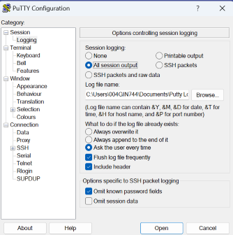

<h1 align="center">Prerequisites for Disruptive OS Activity</h1>

## Goal

This article helps you with the pre-check command guidance for disruptive OS activity.

## Procedure

Below listed are the Pre & Post check steps to be followed during DISRUPTIVE activities.

!!! warning inline "Note"
    Before starting any activity save the log of your current putty session login
    and start the activity.
<figure markdown="span">
  { width="300" }
</figure>

**1**.Check the uptime, system date time, redhat release version, uname details (This must be documented and shared where-ever required)

```bash
# uptime;date;cat /etc/redhat-release;uname -a
```

**2**.Check all available network interfaces.

```bash
# ifconfig -a
```

**3**.Check the network statistics.

```bash
# netstat -tulpn
```

**4**.Check all the existing services details (which includes enabled/disabled & active/inactive services)

```bash
# systemctl list-unit-files
```

**5**.Check the recursive disk utilization status. (If required add new disk to server and extend the LV)

```bash
# cat /etc/fstab
# df -hTP
```

**6**.Check the subscription manager status.

```bash
# subscription-manager status
# subscription-manager list --installed
```

**7**.Check the enabled and available repositories.

```bash
# yum repolist all 
```

**8**.Check and list out all the installed packages along with versions.

```bash
# rpm -qa | nl
```

**9**.Check and ensure the processes of applications and its related middlewares are in stopped state.

- Check the cronjobs for all active cron jobs for the current user:

```bash
# cronjob -l            ------> active cron jobs for the current user
# crontab -u user -l    ------> show cron jobs for a specific user
```

- The process of listing all the cron jobs for all users, we can use the below bash script.

```bash
!/bin/bash
for user in $(cut -f1 -d: /etc/passwd); do
    echo "Crontab for $user:"
    sudo crontab -u $user -l
    echo ""
done
```

**10**.Backup the fstab file, then comment out the mounts other than system related ones.

Take backup of
                sshd configuration file.
                pam.d authentication & configuration files.
                DUO configuration files.

**11**.Keep ready with the root passwd. For safer side reset the root passwd of own.

**12**.Before the snapshot VM expires,
    a.The application team should validate the servers and get back to us for concerns.
    b.We must resolve the raised issues.
    > Else revert the snapshot from VM.

!!! warning "Note"
    Before making any changes in system files take a backup of that file in same location.

!!! tip "Useful Links:"
    - For Leapp package - <https://access.redhat.com/articles/3664871>
    - DUO Configuration - <https://w3.ibm.com/w3publisher/ibm2fa/server-admins/unix>
    - QRadar Configuration - <https://w3.ibm.com/w3publisher/ciso-security-log-standard/server-os/linux/rhel-centos-8-0-2>
    - QRadar Validation - <https://mss.secintel.ibm.com/qradar_tools/>
    - Falcon Installation - <https://pages.github.ibm.com/edr-ciso/documentation/linux_installation.html>
    - For Falcon package - <https://github.ibm.com/cisoedr/crowdstrike-sensor/tree/master/WW/Linux/N>
    - Falcon Validation - <https://cs-host-verification-prod.wdc1a.cirrus.ibm.com/>
