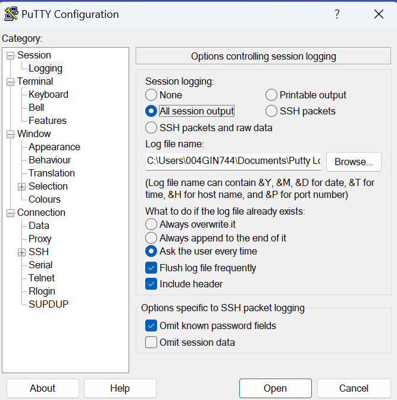

Below listed are the Pre & Post check steps to be followed in DISRUPTIVE activities.

Initially, before starting the activity save the log of your current putty session login and start the activity.
   
Check the uptime, system date time, redhat release version, uname details (This must be documented and shared where-ever required)
```bash
# uptime;date;cat /etc/redhat-release;uname -a
```
Check all available network interfaces.
```bash
# ifconfig -a
```
Check the network statistics.

Check all the existing services details (which includes enabled/disabled & active/inactive services)

Check the recursive disk utilization status. (If required add new disk to server and extend the LV)

Check the subscription manager status.

Check the enabled and available repositories. 

Check and list out all the installed packages along with versions.

Check and ensure the processes of applications and its related domains are in stopped state.

Check the cronjobs for all users.

Backup the fstab file, then comment out the mounts other than system related ones.

Take backup of sshd configuration file.

Take backup of pam.d authentication & configuration files.

Take backup of DUO configuration files.

Remove all old kernels.

change root passwd.

Follow the steps mentioned in below pages (OS -Upgrade from 7 to 8)

Use the fix steps only for the inhibitors which was listed during the activity.

Post the ‘leapp upgrade reboot’ the server can be accessed only in console.

In console, 
    a.	Just test the connection of ssh and use fix steps as stated on screen.
    b.	Remove the old DUO version and install the new version.
    c.	After DUO installation replace the DUO configuration files from the backup (which was taken before the activity).
    d.	Uncomment the fstab entries.
    e.	Reboot the server again.

Once the above steps are completed we will be able to SSH the server via putty.

Install the falcon-sensor.

Re-configure the QRadar.

Post activity completion again do the steps mentioned above from step 1.

Validate the Pre & Post outputs.

Start the required domains (DB/Datastage/WAS/MQ).

Notify the application team to start the application and to validate.

Before the snapshot VM expires, 
    a.	The application team should validate the servers and get back to us for concerns.
    b.	We must resolve the raised issues.

Else revert the snapshot from VM.

Note: Before making any changes in system files take a backup of that file in same location 

###***Useful Links:***

For Leapp package - https://access.redhat.com/articles/3664871 

DUO Configuration - https://w3.ibm.com/w3publisher/ibm2fa/server-admins/unix 

QRadar Configuration - https://w3.ibm.com/w3publisher/ciso-security-log-standard/server-os/linux/rhel-centos-8-0-2

QRadar Validation - https://mss.secintel.ibm.com/qradar_tools/

Falcon Installation - https://pages.github.ibm.com/edr-ciso/documentation/linux_installation.html 

For Falcon package - https://github.ibm.com/cisoedr/crowdstrike-sensor/tree/master/WW/Linux/N 

Falcon Validation - https://cs-host-verification-prod.wdc1a.cirrus.ibm.com/