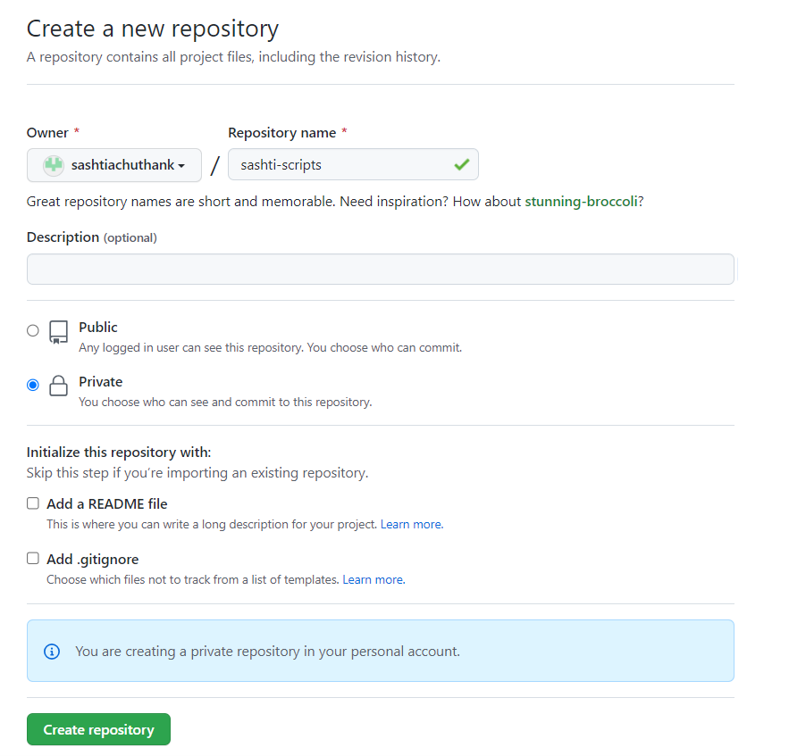
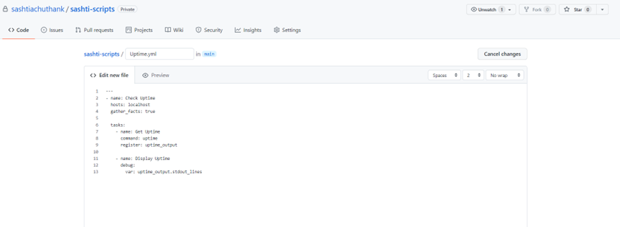
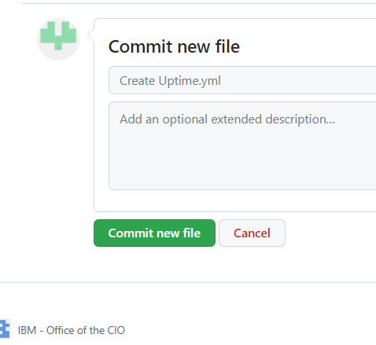
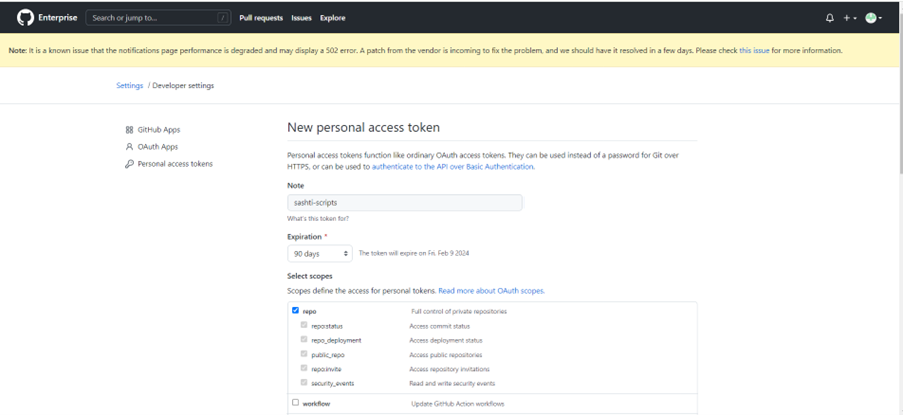
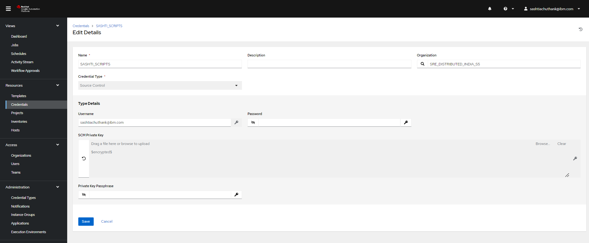
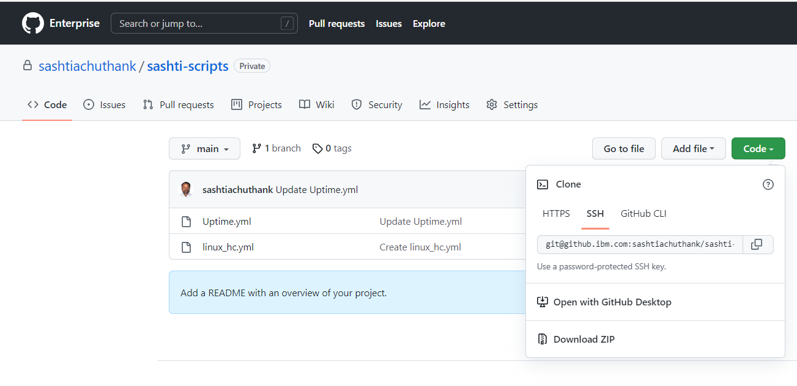

<h1 align="center">To Merge AAP and GIT accounts</h1>

## Goal

This article helps to Merge your AAP and GIT accounts so that you can execute the templates in applicable hosts.

## Procedure

Please follow the below steps for linking the AAP and GIT accounts. 

**Step: 1**

Login to your GIT account and under your profile name select the new repository creation icon.

{ .skip-lightbox }

**Step: 2**

You will be taken to this page once after you clicked the "New" repository icon. 
    
Enter a appropriate name for the new repository. Then choose the the preferred account type as either public or private.

Also mark a tick at the {==***"Add a README file"***==}. Then click the {==***"create repository"***==} option.

{ .skip-lightbox }

**Step: 3**

{ .skip-lightbox }

**Step: 4**

**Step: 5**

{ .skip-lightbox }

**Step: 6**

{ .skip-lightbox }

**Step: 7**

{ .skip-lightbox }

**Step: 8**

**Step: 9**

**Step: 10**

**Step: 11**

