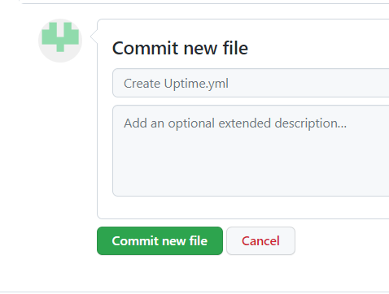

<h1 align="center">To Merge AAP and GIT accounts</h1>

## Goal

This article helps to Merge your AAP and GIT accounts so that you can execute the templates in applicable hosts.

## Procedure

Please follow the below steps for linking the AAP and GIT accounts.

***Step: 1***

Login to your GIT account and under your profile name select the new repository creation icon.

{ .skip-lightbox }

***Step: 2***

You will be taken to this page once after you clicked the "New" repository icon.

Enter a appropriate name for the new repository. Then choose the the preferred account type as either public or private.

{ .skip-lightbox }

***Step: 3***

As ==highlighted== in the below image, please select the ==create a new file== option.

***Step: 4***

Enter the script which you have prepared for execution. Choose a name for the script with =='.yml'== extension as shown in below image.

***Step: 5***

Post feeded the script we need to commit the file.

{ .skip-lightbox }

***Step: 6***

After commiting the script, we need to create a personal access token. For creating the token please follow the path as shown in below screenshots.

Profile ``->`` Settings ``->`` Developer Settings ``->`` Personal Access Tokens ``->`` ==Generate new token==.

{ .skip-lightbox }
{ align=right .skip-lightbox }

***Step: 7***

Give a note name to this token and enable the "repo" & "notifications" then click ==Generate token==.

***Step: 8***

Now, we need to create a new credential in AAP. So login in to your AAP account. Select & fill the page as shown in below screenshot.

    > Use your w3 id credentials for username & Password

