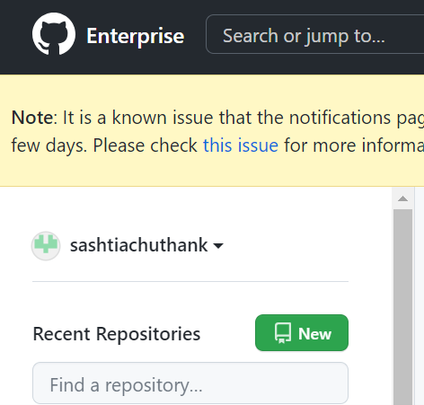
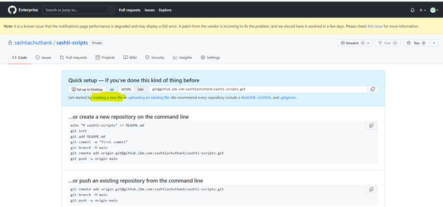
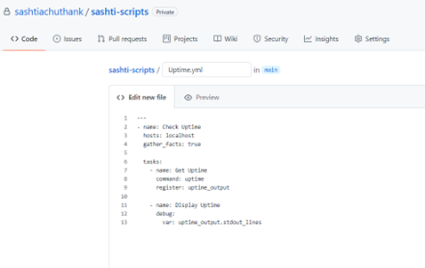
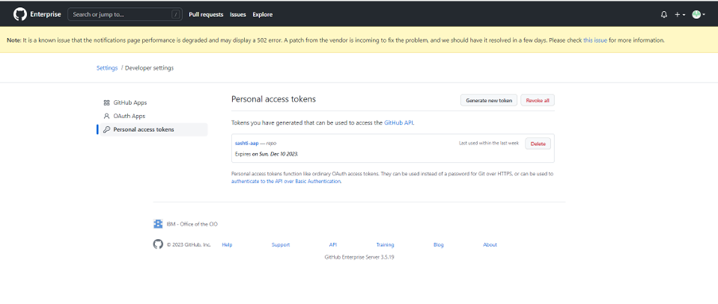

<h1 align="center">To Merge AAP and GITHUB accounts</h1>

## Goal

This article helps to Merge your AAP and GITHUB accounts so that you can execute the templates in applicable hosts.

## Procedure

Please follow the below steps for linking the AAP and GITHUB accounts.

***Step: 1***

Login to your GITHUB account and under your profile name select the new repository creation icon.

<figure markdown="span">
    { width='300' .skip-lightbox }
</figure>

***Step: 2***

Enter a appropriate name for the new repository. Then choose the the preferred account type as either public or private. The new repository will be created once you clicked the ==Create repository==.

> - **Public** account means it can be accessed by other accounts.
> - **Private** account means it will be accessed only by the creator and added contributors.

{ .skip-lightbox }

***Step: 3***

Inside the repository as ==highlighted== in the below image, select the ==create a new file== option.



***Step: 4***

Enter the script which you have prepared for execution. Save the script with =='.yml'== extension as shown in below image. Post feeded the script we need to commit the file.

{ width='450' }
{ align=right width='200' }

***Step: 5***

After commiting the script, we need to create a personal access token. For creating the token please follow the path as shown in below screenshots.

Profile ``->`` Settings ``->`` Developer Settings ``->`` Personal Access Tokens ``->`` ==Generate new token==.

{ .skip-lightbox }
{ align=right .skip-lightbox }


***Step: 6***

Give a note name to this token and enable the "repo" & "notifications" then click ==Generate token==.


***Step: 7***

Now, we need to create a new credential in AAP. So login in to your AAP account. Select & fill the page as shown in below screenshot.

    > Attach local SSH private key which is generated in your laptop.


!!! tip "To generate SSH key"

    For generating the SSH key, Open the command prompt in your laptop and execute the below command by replacing the email ID with your's.
    ```bash
    C:\Users\004GIN744>ssh-keygen -t ed25519 -C "sashtiachuthank@ibm.com"
    ```
    <figure markdown="span">
    { width=400 }
    </figure>

***Step: 8***

The next step will be project creation in AAP. For that we need the SSH code of the github account. So copy the SSH code as shown in below screenshot.


***Step: 9***

In AAP, add a new project by updating the required fields as shown in below screenshot.


***Step: 10***

Once you have created the project ensure it is in ==**Successfull**== state.


***Step: 12***

Then please go to the ==Job Template== option and create a new template by looping the **YML** file created in github as shown in below screenshots.


***Step: 13***

Now you should be able to access the script file under ==Templates== by searching it with the saved script name.

