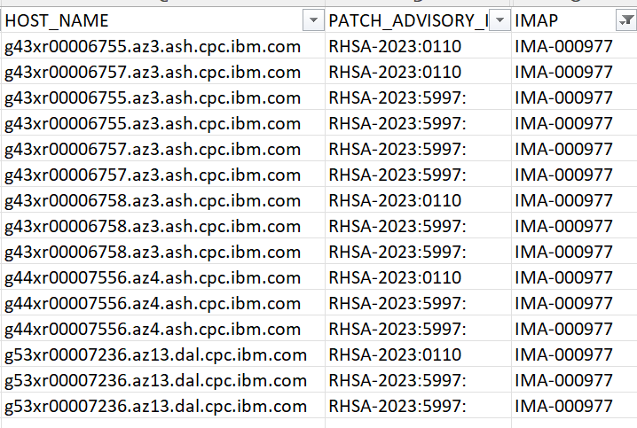

<h1 align="center">Splunk Patching Process</h1>

This article helps you for validating the pending patches extracted from SPLUNK portal.

***Step: 1***

Extract the pending patches CSV file from SPLUNK portal.


***Step: 2***

In the exported excel, based on IMAP, get the Hostname and its PATCH_ADVISORY_ID



***Step: 3***

Remove the duplicate PATCH_ADVISORY_IDs


***Step: 4***

Edit and replace the PATCH_ADVISORY_IDs in below command.

```bash
yum update --advisory=RHSA-2023:0110 --assumeno;
yum update --advisory=RHSA-2023:5997 --assumeno

```

***Step: 5***

SSH to the host and execute the above command for manual check.

For multiple hosts in AAP, run an ad-hoc job as shown below.


***Step: 6***

Validate the job output and list out the applicable and not applicable advisories.

- If the package name is listed, then it is APPLICABLE
- If the package name is not listed, then it is NOT_APPLICABLE

***Step: 7***

As per the below job output the 2 advisories are not appliable in the respective hosts.

[ad_hoc_command_701863.txt](./pictures/ad_hoc_command_701863.txt){:download="ad_hoc_command_701863.txt"}

To mark them as not applicable in SPLUNK portal, login to AAP and use the below template

***“AO_DS_JT_Proactive_Patching_NotApplicable”***

For above template execution, use as per the below format for marking the advisories as not applicable.

```bash
g43xr00006755.az3.ash.cpc.ibm.com, RHSA-2023:5997, platform-python, Not_Applicable
g43xr00006755.az3.ash.cpc.ibm.com, RHSA-2023:5997, python3-libs, Not_Applicable
g43xr00006755.az3.ash.cpc.ibm.com, RHSA-2023:0110, sqlite-libs, Not_Applicable
g43xr00006757.az3.ash.cpc.ibm.com, RHSA-2023:5997, platform-python, Not_Applicable
“ “ “ “
“ “ “ “
“ “ “ “
“ “ “ “
```

***Step: 8***

For the ==applicable== packages installation/upgradation. Please raise ==CHANGE REQUEST== as per process and use the below command for manual patching.

```bash
yum update --advisory=RHSA-2023:0110;
yum update --advisory=RHSA-2023:5997

```
