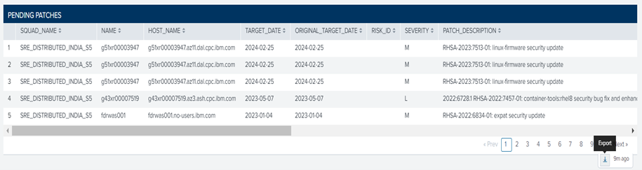
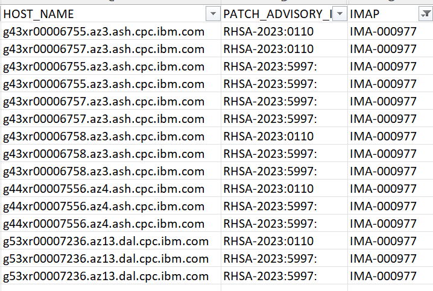
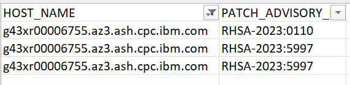
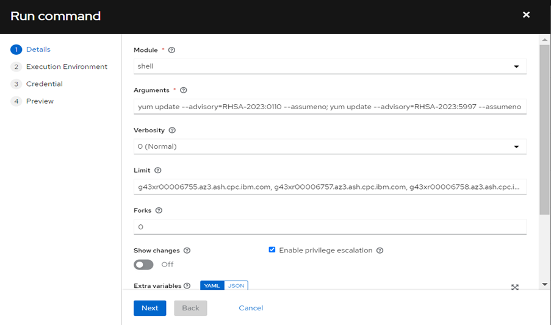

<h1 align="center">Splunk Patching Process</h1>

This article helps you for validating the pending patches extracted from SPLUNK portal.

**Step: 1**

Extract the pending patches CSV file from SPLUNK portal.



**Step: 2**

In the exported excel, based on IMAP, get the Hostname and its PATCH_ADVISORY_ID



**Step: 3**

Remove the duplicate PATCH_ADVISORY_IDs 



**Step: 4**

Edit and replace the PATCH_ADVISORY_IDs in below command. 
```bash

yum update --advisory=RHSA-2023:0110 --assumeno;
yum update --advisory=RHSA-2023:5997 --assumeno

```

**Step: 5**

In AAP, run an ad-hoc job as shown below.



**Step: 6**

Validate the job output and list out the applicable and not applicable advisories.

        a. If the package name is listed APPLICABLE
        b. If the package name is not listed, then it is NOT_APPLICABLE

<a href="ad_hoc_command_701863.txt" download>ad_hoc_command_701863.txt</a>

**Step: 7**

As per the above job output the 2 advisories are not appliable in the respective hosts.

**Step: 8**

To mark them as not applicable in SPLUNK portal, in AAP use the below template

        ***“AO_DS_JT_Proactive_Patching_NotApplicable”***

**Step: 9**

For above template, use as per the below format for marking the not applicable advisories.

```bash

g43xr00006755.az3.ash.cpc.ibm.com, RHSA-2023:5997, platform-python, Not_Applicable
g43xr00006755.az3.ash.cpc.ibm.com, RHSA-2023:5997, python3-libs, Not_Applicable
g43xr00006755.az3.ash.cpc.ibm.com, RHSA-2023:0110, sqlite-libs, Not_Applicable
g43xr00006757.az3.ash.cpc.ibm.com, RHSA-2023:5997, platform-python, Not_Applicable
“	“	“	“
“ 	“	“	“
“	“	“	“
“	“	“	“

```